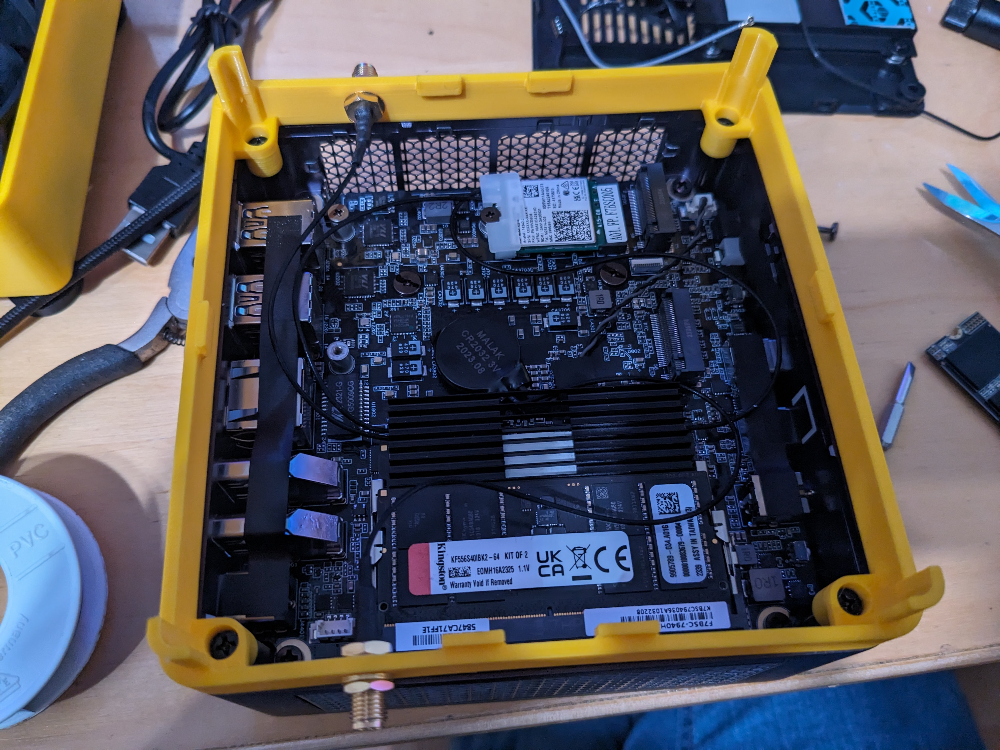
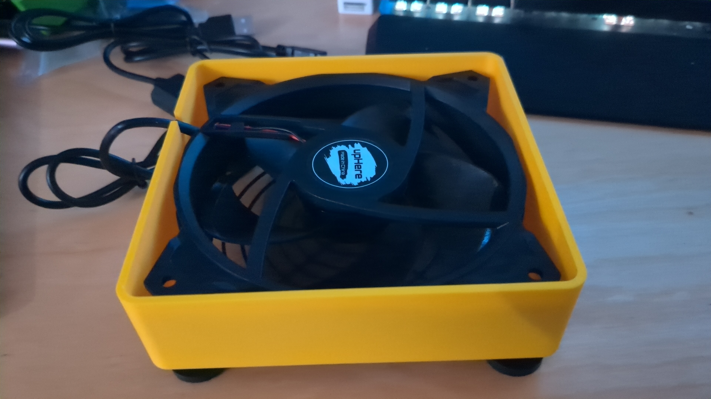
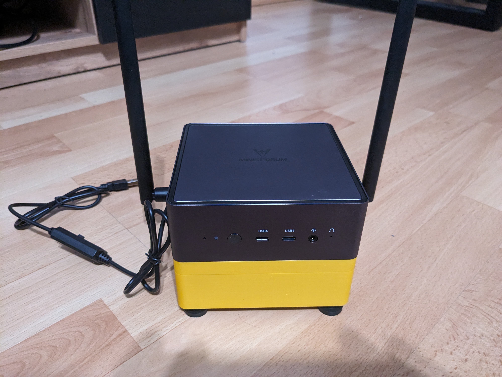

# Minisforum UM790 Pro 120mm Fan Body
This is a fan case for Minisforum UM790 pro with ports for external antennas. As the internal fan for SSD and Memory seems to often fail and has a pretty bad temperature curve without a proper hysteresis I decided to replace it with a 120mm fan as it kinda fits with the size of the mini pc. 

It consists of two parts. One to house the fan and another one to mount to the top and hold the two antennas. 

The fan itself connects via a USB cable to one usb port on the back of the mini PC. You can use pretty much any 120mm fan that connects via usb. I additionally added a filter to not suck dust into the PC. 

## Assembly

### Top Part Assembly
1. Print both of the parts. I printed them on a Bambu Labs P1C with default settings. The top part needs support (I enabled Tree supports which turned out fine). 
2. Screw the sma connectors of the two antennas into the 2 holes in the top part on the left and right side
3. Remove the bottom lid of the UM790 - be careful with the cables. 
4. Unplug the original fan. 
5. Remove the WiFi card screw and slide off the plastic cover. 
6. Attach the two mini connectors to the WiFi card (I did it outside of the case on a flat surface - it was easier)
7. Attach the WiFi card back into the case 
8. Try to find resonable place for the cables so that they cannot hang downwards when the bottom part is assembled so they don't touch the fan later. 
9. Use the 4 original screws to to fit the top part onto the UM790 pro

### Bottom Part Assembly
1. First put the filter into the case
2. Put the fan into the case so the fan direction will push air into the case (logo of the fan shows downwars towards the filter)
3. From the outside, put the fan grill and screw the feet into the fan through the 4 holes of the 3d printed bottom case part

Top
### Final Assembly
1. Put the top part with the UM790 onto the bottom part so they slide into each other
2. attach the two antennas on the sides

## Parts

### 120mm USB Fan
A 120mm fan that you can connect via USB. 

Amazon.de: https://amzn.to/3RZcTu3

### Dust filter for 120mm fans
Optional: A dust filter that stops the fan from pulling in dust particles from the bottom. 

Amazon.de: <https://amzn.to/41W7HvQ>

### External Antennas

External antennas to connect Bluetooth and WiFi because the original antennas are embedded into the bottom case lid. 

Amazon.de: https://amzn.to/47tY6NS
